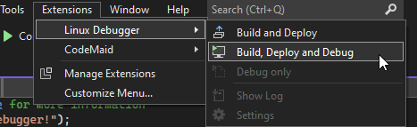
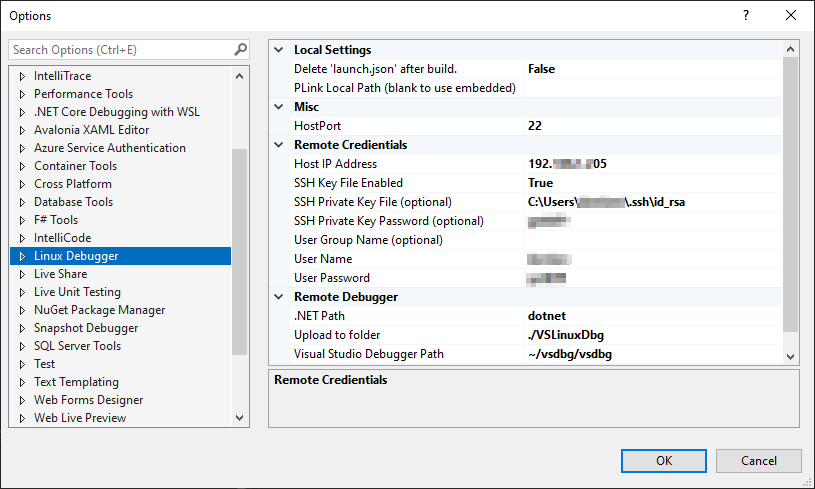

# [VS .NET Linux Debugger](https://github.com/SuessLabs/VsLinuxDebug)

<image align="right" width="200" height="200" src="https://github.com/SuessLabs/VsLinuxDebug/blob/master/docs/TuxDebug.png" />

Remotely deploy and debug your .NET C# apps via SSH to Linux using Visual Studio 2022.

Get it on the [VS MarketPlace](https://marketplace.visualstudio.com/items?itemName=SuessLabs.VSLinuxDebugger)!

Visual Studio's "attach to process via SSH" is cute, but it lacks deployment and automatic attaching. This project allows you to do just that on your Linux VM or Raspberry Pi over the network!

Suess Labs consulting is sponsored by _Xeno Innovations, Inc._

## Overview

Now developers can build, deploy and debug projects on their remote Linux (Ubuntu, Raspberry PI, etc) devices! Customize your SSH connection to use either a _password_ or a _private key_.

If you enjoy using the extension, please give it a ★★★★★ rating on the [Visual Studio Marketplace](https://marketplace.visualstudio.com/items?itemName=SuessLabs.VSLinuxDebugger).

### Supported Remote OS

The following Linux distrobutions have been validated and are supported.

* Ubuntu (20.04 LTS, 22.04 LTS)
* Raspberry PI OS

### Usage



* Build and upload to remote devices
* Remote debugging*
  * _This is still in the experimental stages. Please use VS' Attach to Process if you have issues_
* VS Linux Debugger will automatically detect and install `vsdbg` for you!

For GUI app debugging, you can use the _Build and Deploy_ feature, however, you must manually _Attach to Process_ via SSH using Visual Studio at this time.

### Getting Started

**Linux**, we'll need **SSH** and **cURL** for access and downloading any missing tools:

```bash
sudo apt install openssh-server
sudo apt install curl
```

**Windows**:

1. Open Visual Studio (VS) > Tools > Options > **Linux Debugger**
2. **Input:** Remote Host IP address
3. **Input:** Remote's User Name and Password
4. VS > Extensions > Linux Debugger > **Build, Deploy, Debug**



### Manually Attaching (for GUI apps)

For GUI projects, you can use **Build and Deploy** and then manually attach to the process via SSH by using Visual Studio's built-in tool

1. Deploy to remote machine via
   1. Extensions > Linux Debugger > **"Build and Deploy"**
2. Run GUI app on remote machine
   1. `dotnet MyGuiApp.dll`
3. Debug > **"Attach to Process.."**
4. Connection Type: **SSH**
5. Connection Target: **(Remote machine's IP)**
6. (Select process)
7. Click, **Attach**
8. Check, **"Managed (.NET Core for Unix)"**
9. Click, **OK**

This will save you 1.5 minutes on every build of manual uploading and updating rights via `chown -R`.

## How To Generate Private Key (optional)

The following steps are options if you wish to use an SSH Private Key. These steps were written for Windows 10, however, on Linux the steps are similar.

1. Open PowerShell:
2. **Generate key** (_with old PEM format_)
   1. `ssh-keygen -m PEM -t rsa -b 4096`
   2. In the future, we'll be able to use `ssh-keygen`.. just not yet.
3. Set output name (_default is okay for basic setups_)
4. Input a passphrase for the key _(OPTIONAL)_
5. Windows will now generate your RSA public/private key pair.
   1. Default location: `%UserProfile%\.ssh` (WINOWS)
   2. The public key will be stored as `id_rsa.pub` in the directory
6. **Upload the public key** to your remote machine
   1. Navigate to folder, `~/.ssh/` on Linux device
   2. If `~/.ssh/authorized_keys` exists, append the contents of `id_rsa.pub` to the next line.
   3. If it does not exist, simply upload `id_rsa.pub` and rename it to, `authorized_keys`
7. DONE!

## Future Features

* [ ] **Debugging:** Launching of GUI apps for remote debugging
* [ ] **Debugging:** PLink using PPK instead of manual password
* [ ] **Options Window:** Multiple remote profile management
* [ ] **Options Window:** SSH PPK generator assistant tool

## Developers Wanted

Contributors and Q/A are welcomed!

To contribute, please pick off an item from the project or issue page. We'd love to hear your enhancement ideas as well.

## References

* [PuTTY PLink](http://www.chiark.greenend.org.uk/~sgtatham/putty/download.html)
* [Extension Docs](https://docs.microsoft.com/en-us/visualstudio/extensibility/creating-a-settings-category?view=vs-2022)
* [Extension Sample](https://github.com/microsoft/VSSDK-Extensibility-Samples/tree/master/Options)
* [Offroad Debugging](https://github.com/Microsoft/MIEngine/wiki/Offroad-Debugging-of-.NET-Core-on-Linux---OSX-from-Visual-Studio)


_Copyright 2024 Xeno Innovations, Inc._
