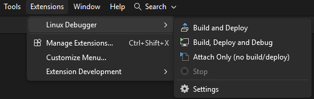
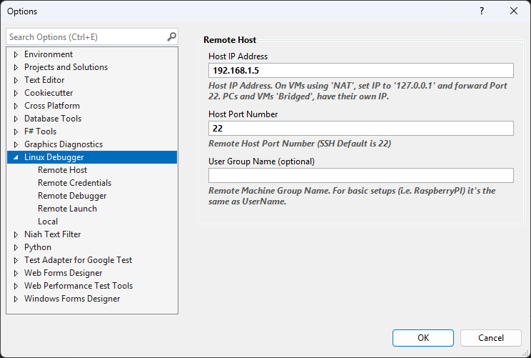

# [VS .NET Linux Debugger](https://github.com/SuessLabs/VsLinuxDebug)

<image align="right" width="200" height="200" src="https://github.com/SuessLabs/VsLinuxDebug/blob/master/docs/TuxDebug.png" />

Remotely deploy and debug your .NET C# apps via SSH to Linux using Visual Studio 2022.

Get it on the [VS MarketPlace](https://marketplace.visualstudio.com/items?itemName=SuessLabs.VSLinuxDebugger)!

Visual Studio's "attach to process via SSH" is cute, but it lacks deployment and automatic attaching. This project allows you to do just that on your Linux VM or Raspberry Pi over the network!

Suess Labs consulting is sponsored by _Xeno Innovations, Inc._

## Overview

Now developers can build, deploy and debug projects on their remote Linux (Ubuntu, Raspberry PI, etc) devices! Customize your SSH connection to use either a _password_, a _private key_, or an SSH CA-signed certificate.

If you enjoy using the extension, please give it a ★★★★★ rating on the [Visual Studio Marketplace](https://marketplace.visualstudio.com/items?itemName=SuessLabs.VSLinuxDebugger).

### What's new

* **SSH CA certificate authentication** — supports a private key with an accompanying `<key>-cert.pub` certificate (auto-detected next to the key, or set explicitly), in addition to password and plain private-key auth.
* **Sudo-elevated debugger launch** — an opt-in setting launches `vsdbg` via a configurable `sudo` command, for debuggees running with elevated or ambient capabilities that the debugger must match to attach.
* **Deploys via `dotnet publish`** — always produces a real native executable (self-contained or framework-dependent, your choice), with the executable bit restored after transfer (lost by default over tar/scp from Windows).
* **Environment variables for the debuggee** — pass `KEY=VALUE` pairs through to the remote process, for programs that read required configuration from the environment.
* **Configurable pre/post-deploy commands and attach-to-running-process** — run arbitrary shell commands before/after each deploy (i.e. stopping/restarting a systemd service), and optionally attach the debugger to that already-running process (via a configurable PID-lookup command) instead of launching a new one.
* **Attach Only** — reattach to a running/deployed process without rebuilding or redeploying.
* **Stop button** — cancels an in-progress build/deploy/debug between steps.
* **Modernized Options UI** — settings are split across focused Tools > Options pages (Remote Host, Remote Credentials, Remote Debugger, Remote Launch, Local) built with a real WPF UI (checkboxes, dynamic show/hide for dependent fields) instead of a single page with a WinForms PropertyGrid.
* Support for Visual Studio 2026 and newer .NET target frameworks (net8.0, net10.0).

### Supported Remote OS

The following Linux distributions have been validated and are supported.

* Ubuntu (20.04 LTS, 22.04 LTS, 24.x LTS)
* Raspberry Pi OS
* Debian-based embedded Linux images (i.e. Yocto/OpenEmbedded targets), where `curl` and an SSH server are available

### Usage



* **Build and Deploy** — build, upload to the remote device, and (re)start it if pre/post-deploy commands are configured.
* **Build, Deploy and Debug** — the above, then attach the debugger (or launch it, for a fresh non-supervised process).
* **Attach Only (no build/deploy)** — reattach to whatever's already running/deployed, without rebuilding or redeploying.
* **Stop** — cancels an in-progress build/deploy/debug between steps.
* VS Linux Debugger will automatically detect and install `vsdbg` for you!

For GUI app debugging, you must manually _Attach to Process_ via SSH using Visual Studio at this time (see below).

### Getting Started

**Linux**, we'll need **SSH** and **cURL** for access and downloading any missing tools:

```bash
sudo apt install openssh-server
sudo apt install curl
```

**Windows**:

1. Open Visual Studio (VS) > Tools > Options > **Linux Debugger**
2. Configure the **Remote Host** page (IP address) and **Remote Credentials** page (user name, and either a password, a private key, or an SSH CA certificate)
3. Optionally, configure **Remote Debugger** (deploy folder, self-contained/RID) and **Remote Launch** (env vars, pre/post-deploy commands, attach-to-running-process, sudo, X11)
4. VS > Extensions > Linux Debugger > **Build, Deploy and Debug**



### Manually Attaching (for GUI apps)

For GUI projects, you can use **Build and Deploy** and then manually attach to the process via SSH by using Visual Studio's built-in tool

1. Deploy to remote machine via
   1. Extensions > Linux Debugger > **"Build and Deploy"**
2. Run GUI app on remote machine
   1. `dotnet MyGuiApp.dll`
3. Debug > **"Attach to Process.."**
4. Connection Type: **SSH**
5. Connection Target: **(Remote machine's IP)**
6. (Select process)
7. Click, **Attach**
8. Check, **"Managed (.NET Core for Unix)"**
9. Click, **OK**

This will save you 1.5 minutes on every build of manual uploading and updating rights via `chown -R`.

If your remote device uses **SSH CA-signed certificates** instead of `authorized_keys` (i.e. `TrustedUserCAKeys` configured in `sshd_config`), point "SSH Private Key File" at your CA-issued private key; the matching `<key>-cert.pub` certificate is picked up automatically if it sits next to the key, or can be set explicitly via "SSH Certificate File" on the Remote Credentials options page.

## Future Features

* [ ] **Debugging:** Launching of GUI apps for remote debugging
* [ ] **Debugging:** PLink using PPK instead of manual password
* [ ] **Options Window:** Multiple remote profile management
* [ ] **Options Window:** SSH PPK generator assistant tool

## Developers Wanted

Contributors and Q/A are welcomed!

To contribute, please pick off an item from the project or issue page. We'd love to hear your enhancement ideas as well.

## References

* [PuTTY PLink](http://www.chiark.greenend.org.uk/~sgtatham/putty/download.html)
* [Extension Docs](https://docs.microsoft.com/en-us/visualstudio/extensibility/creating-a-settings-category?view=vs-2022)
* [Extension Sample](https://github.com/microsoft/VSSDK-Extensibility-Samples/tree/master/Options)
* [Offroad Debugging](https://github.com/Microsoft/MIEngine/wiki/Offroad-Debugging-of-.NET-Core-on-Linux---OSX-from-Visual-Studio)


_Copyright 2024 Xeno Innovations, Inc._
